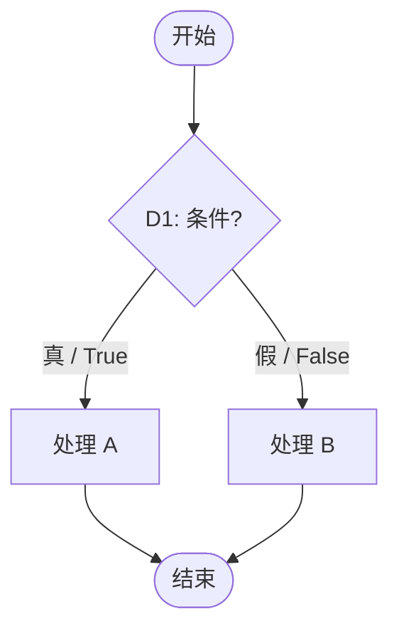

# whitebox-testing

白盒测试专家助手，帮助你进行系统化的代码结构分析和测试用例设计。

White-box testing skill for systematic code-structure analysis and coverage-driven test design.

本文档采用混合双语格式：核心说明使用中英双语，命令、模板和示例尽量保留单份，兼顾可读性与上下文效率。

This document uses a mixed bilingual format: core guidance is bilingual, while commands, templates, and examples stay single-sourced to keep the skill readable and efficient.

## 核心价值 / Core Value

使用此 skill 可获得：

Using this skill helps you produce:

1. **完整的路径分析 / Complete path analysis**：识别判定节点、列举独立路径、计算覆盖率需求
2. **圈复杂度评估 / Cyclomatic-complexity assessment**：McCabe 复杂度计算 + 风险评级 + 重构建议
3. **清晰的流程图 / Clear flow diagrams**：Mermaid 控制流程图，直观展示代码结构
4. **专业测试用例 / Professional test cases**：符合 pytest/Jest/JUnit 规范的测试代码
5. **覆盖率优化建议 / Coverage-improvement guidance**：具体命令和迭代策略

## 触发条件 / When to Trigger

**必须使用此 skill 的场景 / Must use this skill when:**

- 用户提到 "白盒测试"、"white-box testing"、"覆盖率" / The user explicitly mentions white-box testing or coverage goals.
- 用户要求分析代码路径、判定节点、控制流 / The user asks to analyze code paths, decision points, or control flow.
- 用户需要计算圈复杂度（McCabe 复杂度） / The user wants cyclomatic complexity or McCabe complexity.
- 用户要求设计"全面的"、"系统的"、"完整的"测试用例 / The user asks for comprehensive or systematic structural test design.
- 用户提到 pytest、Jest、JUnit 等测试框架的覆盖率功能 / The user refers to framework-level coverage features such as pytest, Jest, or JUnit coverage.

**可选使用场景 / Optional use cases:**

- 用户要求对某个函数进行单元测试 / The user asks for unit tests for a specific function.
- 用户询问如何提高测试质量 / The user asks how to improve test quality.
- 用户提到边界值、边界条件测试 / The user mentions boundary-value or boundary-condition testing.

## 执行流程 / Workflow

### 步骤 1：确认测试目标 / Step 1: Confirm the Testing Target

先确认编程语言和覆盖标准，再按下述规则自动发现或询问被测代码文件：

First confirm the language and coverage criterion, then discover or ask for the target source file according to the rules below:

1. **编程语言 / Language**：Python / Java / JavaScript/TypeScript / C/C++ / Go / 其他
2. **覆盖标准 / Coverage criterion**：语句覆盖 / 判定路径覆盖
3. **被测代码文件 / Target source file**：不要仅按文件大小或最近提交直接猜测，必须执行下面的目标选择流程

Do not choose the target merely by file size or the latest commit. The target-selection workflow below is mandatory.

#### 被测文件自动选择 / Automatic Target Selection

1. **发现源码 / Discover source files**
   - 枚举项目中的源码文件，排除测试目录、测试文件、生成代码、依赖目录、构建产物、迁移快照和 vendor 代码。
   - 按语言和仓库现有命名习惯识别源码，例如 Python 的 `*.py`、JavaScript/TypeScript 的 `*.js`/`*.ts`/`*.jsx`/`*.tsx`、Java 的 `*.java`、C/C++ 的 `*.c`/`*.cc`/`*.cpp`/`*.h`/`*.hpp`。
   - 对源码按**有效代码行数**计数并降序排列。有效代码行默认排除空行；若可靠识别注释不会增加实现成本，也排除纯注释行。不要使用文件字节大小代替代码行数。

   Discover project source files while excluding test files/directories, generated code, dependencies, build outputs, migration snapshots, and vendored code. Rank sources by effective lines of code, not byte size.

2. **建立源码到测试的映射 / Map sources to tests**
   - 先读取仓库测试配置和现有目录结构，再使用语言惯例匹配测试文件。
   - Python 示例：`app/foo.py` 对应 `tests/test_foo.py`、同路径下的 `test_foo.py`，以及名称明确包含 `foo` 的白盒/单元测试文件。
   - JavaScript/TypeScript 示例：`src/foo.ts` 对应 `foo.test.ts`、`foo.spec.ts` 或 `__tests__/foo.*`。
   - Java 示例：`Foo.java` 对应 `FooTest.java`、`FooTests.java`。
   - C/C++ 示例：`foo.c`/`foo.cpp` 对应 `test_foo.*`、`foo_test.*`。
   - 仅凭测试文件中导入或调用了源码，不足以认定为“对应测试”；测试名称、路径或测试配置还必须表明它以该源码模块为主要目标。一个源码可对应多个测试文件。

   Inspect repository test configuration and naming conventions before mapping. A source may map to multiple tests. Incidental imports alone do not make a test a corresponding test file.

3. **优先选择无测试源码 / Prefer an untested source**
   - 如果存在一个或多个没有对应测试文件的源码，列出这些源码及有效代码行数。
   - 自动选择其中有效代码行数最多的一个作为被测代码文件，不再要求用户从已有测试的源码中选择。
   - 若最高行数并列，优先选择业务源码而非入口、配置或数据模型；仍并列时按路径字典序选择，确保结果可重复。

   If any source has no corresponding test file, list the untested sources and select the one with the most effective lines of code. Break ties by preferring business logic, then lexicographically by path.

4. **所有源码都有测试时检查 Git / Check Git when every source has tests**
   - 只有在候选源码全部存在对应测试文件时，才检查当前目录是否由 Git 管理，例如执行 `git rev-parse --is-inside-work-tree`。
   - 不要因为工作区存在未提交修改而停止，也不要修改或还原无关文件。

   Check whether the repository is managed by Git only after every candidate source has a corresponding test. A dirty worktree does not block this analysis.

5. **Git 仓库中的测试时序分析 / Test recency analysis in a Git repository**
   - 对每个源码及其对应测试文件，读取测试文件的**文件系统最后修改时间**作为测试基准时间；一个源码对应多个测试文件时，取其中最新的修改时间，并记录产生该时间的测试文件。不要用测试文件的 Git 提交时间替代文件系统修改时间。
   - 从该基准时间之后的 Git 提交中，找出有修改记录的对应源码文件。使用 `git log --since=<time> --numstat -- <source>` 或等价的非交互命令统计该源码在此期间的累计修改行数：`新增行数 + 删除行数`。
   - 列出所有“测试最后修改之后源码仍有 Git 修改”的源码，包括：源码路径、对应测试、测试基准时间、后续提交数、累计新增、累计删除和累计修改行数。
   - 自动选择累计修改行数最多的源码作为被测代码文件。并列时依次按后续提交数、有效代码行数和路径字典序选择。
   - Git rename 必须尽量使用 `--follow` 或等价方式追踪；二进制文件和无法统计 `numstat` 的变更不纳入修改行数。
   - 如果没有任何源码在测试基准时间之后发生 Git 修改，明确说明测试相对源码是最新的，然后按有效代码行数从多到少列出源码，使用 AskUserQuestion 或等效方式让用户选择，不要擅自指定。

   For each source/test mapping, use the latest filesystem modification time across its corresponding tests as the test baseline. Do not replace it with the tests' Git commit time. After that baseline, sum source additions and deletions from Git history. List stale source/test mappings and automatically select the source with the largest total churn. If no source changed after its tests, present sources ordered by effective LOC and ask the user to choose.

6. **非 Git 仓库由用户选择 / Ask the user in a non-Git repository**
   - 当候选源码全部有对应测试、但当前仓库未使用 Git 管理时，按有效代码行数从多到少列出源码文件。
   - 使用 AskUserQuestion 或等效方式询问用户选择哪个源码作为被测代码文件，不要自动选择。

   If every source has tests but the repository is not managed by Git, list sources from most to fewest effective lines of code and ask the user which source to test.

7. **记录选择依据 / Record the rationale**
   - 在 `path_analysis.md` 的 Scope 中记录：源码发现范围、源码与测试映射、是否为 Git 仓库、采用的选择分支、排序指标和最终目标。
   - 开始路径分析前向用户简要说明选择结果。只有流程要求用户选择时才提问；其余分支直接按规则继续。

   Record the discovery scope, source/test mapping, Git status, selection branch, ranking metric, and final target in the report. Ask only when the rules explicitly require user selection.

### 步骤 2：加载语言指南 / Step 2: Load the Language Guide

根据语言选择对应参考文件：

Choose the matching reference file by language:

- Python -> `references/python.md`
- JavaScript/TypeScript -> `references/javascript.md`
- Java -> `references/java.md`
- C/C++ -> `references/clang.md`
- 其他 / Other -> 使用通用原则 / use the general principles in this skill

### 步骤 3：判定节点分析 / Step 3: Analyze Decision Points

**识别所有判定节点 / Identify all decision points:**

- `if/else` 条件 / conditions
- `for/while` 循环条件 / loop conditions
- `switch/case` 分支 / branches
- `try/catch/finally` 异常处理 / exception handling
- `?:` 三元运算符 / ternary operators
- 逻辑运算符组合 / logical combinations (`&&`, `||`, `!`)

**记录每个判定节点 / Record each decision point:**

| 编号 / ID | 代码位置 / Location | 条件表达式 / Condition | 分支数 / Branches |
|-----------|----------------------|------------------------|-------------------|

### 步骤 4：计算圈复杂度 / Step 4: Calculate Cyclomatic Complexity

**McCabe 公式 / McCabe formula:**

```
V(G) = P + 1
```

其中 `P` = 判定节点数量。 `P` is the number of decision points.

**风险评估表 / Risk table:**

| 复杂度 V(G) / Complexity | 风险级别 / Risk | 测试建议 / Testing guidance |
|--------------------------|-----------------|-----------------------------|
| 1-5 | 低 / Low | 正常测试流程 / Normal testing flow |
| 6-10 | 中 / Medium | 增加边界测试用例 / Add boundary-focused cases |
| 11-20 | 高 / High | 重点测试，考虑重构 / Intensive testing, consider refactoring |
| 21+ | 极高 / Very high | **必须重构拆分函数 / Refactor and split the function** |

**输出重构建议 / Output refactoring guidance**（当 `V(G) > 10`）：

列出可拆分的子函数建议。

List candidate helper functions or sub-functions that can reduce complexity.

### 步骤 5：绘制控制流程图 / Step 5: Draw the Control-Flow Diagram

**使用 Mermaid 流程图 / Use Mermaid flowcharts:**

在 `path_analysis.md` 中直接输出 Mermaid `flowchart` 代码块。Mermaid 由支持它的 Markdown 查看器渲染，不需要安装 Graphviz、Python 包或创建临时脚本。

Emit a Mermaid `flowchart` code block directly in `path_analysis.md`. It is rendered by Mermaid-capable Markdown viewers and requires no Graphviz, Python package, or temporary script.

**先确定图的范围 / Determine diagram scope first:**

在开始绘图前，必须识别被测模块的公共或实际编排入口，并在报告中记录选择结果。流程图不得只展示入口对下游方法的调用关系，而必须展示纳入范围内的实际判定、循环和异常控制流。

Before drawing, identify the public or actual orchestration entry point(s) of the target module and record that choice in the report. A diagram must not merely show calls between methods; it must show the real decisions, loops, and exception control flow within its selected scope.

1. **存在统一入口 / Unified entry point exists**：当一个方法代表模块的端到端业务流程，并调用主要高复杂度方法时，先绘制一张完整模块流程图。该图必须展开入口自身的判断，并以 `subgraph` 或清晰的已展开调用块展示每一个复杂度 `V(G) >= 6` 的被调用方法的控制流。不能把这些方法简化为无内部边的单一矩形节点。
2. **不存在统一入口 / No unified entry point**：当模块有多个可独立调用的公共流程、独立协议操作或后台任务时，必须为每个复杂度 `V(G) >= 6` 的方法分别绘制控制流程图。每张图以方法名作为标题，图内从该方法的入口到所有返回、异常或循环出口。
3. **混合场景 / Mixed case**：若统一入口只调用一部分高复杂度方法，绘制完整入口图，并额外绘制未被该入口覆盖的每一个 `V(G) >= 6` 方法图。
4. **报告可追溯性 / Traceability**：在 `## Control Flow` 前提供“流程图范围表”，列出每个高复杂度方法、复杂度、是否被统一入口图展开覆盖，以及对应 Mermaid 图标题。没有被图覆盖的高复杂度方法必须标为缺失，不能宣称分析完成。
5. **图规模 / Diagram size**：复杂方法可拆为多个子图，但每个判定节点和分支必须在至少一张图中完整可追溯。对于循环，明确画出 0 次退出、循环体和回边；对于 `try/except`，明确画出成功路径和异常出口。

**强制一致性检查 / Mandatory consistency check:**

生成报告前，逐项比较“圈复杂度表”和“流程图范围表”：所有 `V(G) >= 6` 的方法必须被完整入口图展开覆盖或拥有独立图。若不满足，补图后才能进入测试设计和覆盖率收集。

Before finalizing the report, compare the cyclomatic-complexity table against the diagram-scope table. Every method with `V(G) >= 6` must be expanded in the unified entry diagram or have its own diagram. If not, add the missing diagram before designing tests or collecting coverage.



**节点和边的命名规范 / Node and edge naming conventions:**

| 元素 / Element | Mermaid 语法 / Mermaid syntax | 示例 / Example |
|----------------|-------------------------------|----------------|
| 开始/结束 | `([文本])` | `START([开始])` |
| 判定节点 | `{"文本"}` | `D1{"D1: 条件?"}` |
| 处理节点 | `[文本]` | `P1[处理 A]` |
| 成功处理 | `classDef success` | 浅绿色填充 |
| 异常节点 | `classDef exception` | 浅红色填充 |
| 真/假分支 | `-->|标签|` | `D1 -->|真 / True| P1` |
| 循环回边 | `-->|下一轮|` | `P2 -->|下一轮| D1` |

**样式和绘制规则 / Style and diagram rules:**

1. 使用 `flowchart TD`，使主流程从上到下排列；真分支优先置于左侧，假分支置于右侧。
2. 开始/结束使用圆角节点，判定使用菱形，处理使用矩形；每个判定标注 `D1`、`D2` 等编号。
3. 所有判定边都标注真/假；循环回边标注其迭代含义，例如“下一轮”。
4. 异常路径用虚线和 `exception` 样式区分：`P1 -. 异常 .-> EX[返回失败]`，并使用 `class EX exception`；成功处理可使用 `class P1 success`。
5. 复杂流程可使用 `subgraph` 组织循环体、异常处理或分支组，但不得省略实际控制流边；遵循上方的范围规则，不得用一个调用节点替代高复杂度方法的内部流程。
6. 节点文本含有 Mermaid 特殊字符、括号或引号时，使用双引号包裹；避免在节点 ID 中使用中文、空格或标点。
7. 在图后保留节点/边文字列表，作为不支持 Mermaid 的阅读器的后备说明。

### 步骤 6：列举独立路径 / Step 6: Enumerate Independent Paths

**路径格式 / Path format:**

```
路径 P1: 开始 -> D1-真 -> D2-真 -> 处理A -> 结束
路径 P2: 开始 -> D1-真 -> D2-假 -> 处理B -> 结束
路径 P3: 开始 -> D1-假 -> 处理C -> 结束
...
```

**循环路径规则 / Loop-path rules:**

- 循环只需覆盖 **2 次执行** 即可满足判定路径要求 / Two loop executions are usually enough for decision-path coverage.
- 测试：循环 0 次、循环 1 次、循环 2 次 / Test the loop with 0, 1, and 2 executions.

### 步骤 7：设计测试用例 / Step 7: Design Test Cases

**测试用例表格式 / Test-case table format:**

| 用例 ID / Case ID | 覆盖路径 / Covered Path | 输入数据 / Inputs | 预期输出 / Expected Output | 说明 / Notes |
|-------------------|-------------------------|-------------------|----------------------------|--------------|

**必须包含的测试类型 / Required test types:**

1. **基本路径测试 / Basic path tests**：覆盖所有独立路径
2. **边界值测试 / Boundary-value tests**：判定条件的边界值（如 `x > 0` 测试 `x=0, x=-1, x=1`）
3. **异常路径测试 / Exception-path tests**：异常处理分支
4. **组合测试 / Combination tests**：多个条件组合的场景

### 步骤 8：生成测试代码 / Step 8: Generate Test Code

按照语言指南生成规范的测试代码：

Generate test code according to the language guide:

- Python: pytest 格式，`test_` 函数命名，`assert` 断言
- JavaScript: Jest 格式，`describe/it` 结构，`expect` 断言
- Java: JUnit 格式，`@Test` 注解

**测试代码模板 / Test-code template（Python 示例 / Python example）:**

```python
"""
白盒测试：{function_name} 函数判定路径覆盖测试
圈复杂度：V(G) = {complexity}
"""

import pytest
from {module} import {function_name}


class Test{FunctionName}:
    """{function_name} 白盒测试类"""

    # 路径 P1: {path_description}
    def test_path1_{scenario}():
        """{description}"""
        result = {function_name}({inputs})
        assert result == {expected}

    # ... 更多测试用例


@pytest.mark.parametrize("input,expected", [
    # 边界值和组合测试
])
def test_{function_name}_boundaries(input, expected):
    """参数化边界测试"""
    ...
```

### 步骤 9：运行测试并修复源代码问题 / Step 9: Run Tests and Fix Source Issues

**运行测试命令 / Test commands:**

| 语言 / Language | 命令 / Command |
|-----------------|----------------|
| Python | `pytest` |
| JavaScript | `npm test` |
| Java | `mvn test` |

### 步骤 10：收集覆盖率 / Step 10: Collect Coverage

**覆盖率命令 / Coverage commands:**

| 语言 / Language | 命令 / Command |
|-----------------|----------------|
| Python | `pytest --cov={module} --cov-report=term-missing` |
| JavaScript | `npm test -- --coverage` |
| Java | `mvn test jacoco:report` |
| C/C++ | `gcov {file.c}` |

**覆盖率报告解读 / Coverage report interpretation:**

```
Name                    Stmts   Miss  Cover   Missing
----------------------------------------------------
app/module.py             100     10    90%   25-30, 45
```

- **Stmts / Statements**：总语句数
- **Miss / Missing statements**：未覆盖语句数
- **Cover / Coverage**：覆盖率百分比
- **Missing / Missing lines**：未覆盖的行号

### 步骤 11：分析未覆盖代码 / Step 11: Analyze Uncovered Code

**未覆盖原因分类 / Categories of uncovered-code causes:**

| 原因类型 / Cause | 说明 / Description | 处理方式 / Action |
|------------------|--------------------|-------------------|
| 测试缺失 / Missing tests | 有路径但未设计测试 / The path exists but no test covers it | **补充测试用例 / Add tests** |
| 条件限制 / Condition limits | 某些条件不可达 / Some conditions are unreachable | 文档化说明 / Document the reason |
| 死代码 / Dead code | 永远不执行 / Never executes | **考虑删除 / Consider removing it** |
| Mock 限制 / Mock limits | 外部依赖被绕过 / External dependencies were bypassed | 集成测试覆盖 / Cover with integration tests |
| 异常场景 / Exceptional scenarios | 极端错误处理 / Extreme error-handling paths | 评估必要性 / Evaluate necessity |

### 步骤 12：确认目标并迭代优化 / Step 12: Confirm Target and Iterate

**先给出目标覆盖率建议 / First present the suggested target coverage:**

根据被测代码的类型，先向用户展示以下建议表：

Based on the type of the code under test, first show the user the following recommendation table:

| 项目类型 / Project type | 语句覆盖 / Statement | 分支覆盖 / Branch |
|-------------------------|----------------------|-------------------|
| 关键业务 / Critical business logic | 100% | 90%+ |
| 一般功能 / General features | 90%+ | 80%+ |
| 工具函数 / Utility functions | 100% | 100% |
| UI 组件 / UI components | 80%+ | 70%+ |

**然后追问用户需要达到的覆盖率 / Then ask the user what coverage they want to reach:**

使用 AskUserQuestion 或等效提问方式询问用户的目标覆盖率（语句覆盖率、分支覆盖率），并记录用户的确认值作为本次测试目标。

Use AskUserQuestion or an equivalent prompt to ask the user for the target coverage values (statement and branch coverage). Record the confirmed values as the goal for this round.

**迭代直至达到目标 / Iterate until the target is reached:**

如果当前覆盖率未达到用户确认的目标：

If the current coverage is below the user-confirmed target:

1. 分析 `Missing` 行号对应的代码 / Analyze the code behind the `Missing` lines.
2. 设计新测试用例覆盖缺失路径 / Design new tests for the uncovered paths.
3. **重复执行步骤 7 到步骤 11 / Repeat Steps 7 through 11**（重新设计用例 → 生成测试代码 → 运行测试 → 收集覆盖率 → 分析未覆盖代码）。
4. 持续迭代，直到覆盖率达到用户设定的目标为止 / Continue iterating until the coverage meets the user-defined target.

每一轮迭代完成后向用户汇报当前覆盖率与目标的差距，并说明本轮新增的测试用例与覆盖到的路径。

After each iteration, report the gap between current coverage and the target, and describe the new test cases added and the paths they cover.

---

## 输出格式要求 / Required Outputs

完成分析后，必须输出以下文件：

After the analysis, produce the following files:

1. **`path_analysis.md`** - 路径分析报告 / Path-analysis report
   - 判定节点表 / Decision-point table
   - 圈复杂度计算 / Cyclomatic-complexity calculation
    - Mermaid 控制流程图 / Mermaid control-flow diagram
   - 流程图范围表，证明所有 `V(G) >= 6` 方法已由完整入口图展开覆盖或拥有独立图 / Diagram-scope table proving coverage of every `V(G) >= 6` method
   - 节点和边的文字后备说明 / Textual node-and-edge fallback
   - 独立路径列表 / Independent-path list
   - 未覆盖代码分析 / Uncovered-code analysis

2. **`test_{module}.py`** 或 **`{module}.test.js`** - 测试代码文件 / Test-code file
   - 完整的可执行测试用例 / Complete executable test cases
   - 参数化边界测试 / Parameterized boundary tests
   - 清晰的中文注释，必要时可补英文说明 / Clear Chinese comments, with English notes when useful

---

## 注意事项 / Notes

1. **判定路径覆盖是中等难度标准 / Decision-path coverage is a medium-depth standard**，比语句覆盖更全面
2. **圈复杂度 > 10 必须给出重构建议 / If cyclomatic complexity is above 10, provide refactoring advice**
3. **循环只需覆盖 2 次 / Two loop executions are usually enough**，但需测试 0 次和 1 次边界
4. **异常处理路径必须覆盖 / Exception-handling paths must be covered**
5. **不可达代码需要记录并报告 / Unreachable code must be documented and reported**
6. **测试数据必须与函数逻辑一致 / Test data must match the real function logic**，预期值要准确计算

---

## 语言特定指南 / Language-Specific Guides

已创建的语言指南：

Available language guides:

- `references/python.md` - pytest + pytest-cov + Mock
- `references/javascript.md` - Jest + 覆盖率 / coverage + Mock 策略 / mock strategy
- `references/java.md` - JUnit + Mockito + JaCoCo
- `references/clang.md` - Unity + FFF Mock + lcov

---

## 快速模式 / Fast Mode

当用户只需**快速生成测试用例**（不需要完整分析）时：

When the user only needs **quick test generation** instead of a full analysis:

1. 直接读取源代码 / Read the source code directly.
2. 识别主要分支（if/else） / Identify the main branches (`if/else`).
3. 为每个分支设计一个测试用例 / Design one test case for each branch.
4. 添加边界值测试 / Add boundary-value tests.
5. 输出测试代码文件 / Output the test file.

跳过流程图和复杂度计算，直接生成可用测试。

Skip the flowchart and complexity calculation, and go straight to generating practical tests.
